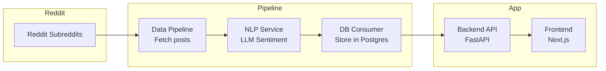

# Smedia: Real-Time Reddit Stock Sentiment Dashboard

---

## Overview (Work-In-Progress)

Smedia is a **containerized, scalable, real-time application** that:

- **Ingests posts** from popular stock-related subreddits
- **Analyzes sentiment** using an LLM (Large Language Model)
- **Organizes posts by ticker and sentiment**
- **Displays live data** in a professional web dashboard
- **Helps users gauge social media sentiment** to inform stock trading decisions

---

## Architecture & Components

### 1. **Data Pipeline**

- **Language:** Python
- **Tool:** PRAW (Reddit API)
- **Function:** Continuously fetches new posts from subreddits like `wallstreetbets`, `stocks`, `investing`
- **Extracts tickers** using regex
- **Publishes raw posts** to Kafka topic `raw_posts`

### 2. **NLP Service**

- **Language:** Python
- **Tool:** Kafka consumer + OpenRouter LLM API
- **Function:** Consumes `raw_posts`
- **Calls LLM** to classify sentiment (Positive, Neutral, Negative), strength (0-1), and key keywords
- **Publishes enriched posts** to Kafka topic `enriched_posts`

### 3. **DB Consumer**

- **Language:** Python
- **Tool:** Kafka consumer + Postgres (TimescaleDB)
- **Function:** Consumes `enriched_posts`
- **Stores enriched posts** in a TimescaleDB hypertable for persistence and querying

### 4. **Backend API**

- **Language:** Python (FastAPI)
- **Function:** Serves REST API endpoints:
  - `/health` - health check
  - `/sentiment-feed` - latest enriched posts from DB
- **Connects to Postgres** via asyncpg connection pool

### 5. **Frontend**

- **Language:** TypeScript + React + Next.js
- **Function:** Displays a **live dashboard** with:
  - Real-time sentiment feed
  - Sentiment strength and keywords
  - Ticker mentions
  - Links to Reddit posts
- **Fetches data** from backend API every few seconds

### 6. **Infrastructure**

- **Message broker:** Kafka (Confluent images)
- **Database:** TimescaleDB (Postgres extension)
- **Search:** Elasticsearch (optional, for future search features)
- **Orchestration:** Docker Compose
- **CI/CD:** GitHub Actions with Docker Hub image publishing

---

## Workflow



---

## LLM Configuration

Smedia uses a **Large Language Model (LLM)** to analyze Reddit post sentiment, strength, and keywords.

### How it works

- The **NLP service** sends a prompt to an LLM API (default: **OpenRouter**)
- The LLM responds with a JSON containing:
  - `sentiment`: Positive, Neutral, or Negative
  - `strength`: score from 0 to 1
  - `keywords`: key phrases influencing sentiment

### Supported LLMs

- **OpenRouter.ai** (default, supports many free and paid models)
- **Any OpenAI-compatible API endpoint**
- **Other LLM APIs** with minor code changes

### Configuring the LLM model

- The model is set in `backend/nlp_service.py`:

```python
data = {
    "model": "quora/quasar-alpha",  # Change this to your preferred model
    "messages": [{"role": "user", "content": prompt}],
    "max_tokens": 150,
    "temperature": 0.2,
}
```

- To use a different model:
  - Find the **model ID** on OpenRouter or your LLM provider
  - Replace `"quora/quasar-alpha"` with the new model ID
  - Examples:
    - `"mistralai/mistral-7b-instruct"`
    - `"meta-llama/llama-2-7b-chat"`
    - `"openchat/openchat-3.5"`
    - `"openai/gpt-3.5-turbo"` (paid)
- You can also change the **API URL** and **API key** in `.env`:

```
OPENROUTER_API_KEY=your-api-key
OPENROUTER_BASE_URL=https://openrouter.ai/api/v1
```

### Notes

- Many free models are available on OpenRouter
- You can self-host or use other LLM APIs with minor changes
- The prompt can be customized in `nlp_service.py` for different outputs

---

## Deployment

### Prerequisites

- **Docker** and **Docker Compose** installed
- **GitHub Container Registry** or **Docker Hub** credentials (images are pushed there)
- **Reddit API credentials** in `.env`
- **OpenRouter API key** in `.env`

### Steps

1. **Clone the repo**

```bash
git clone https://github.com/yourusername/smedia.git
cd smedia
```

2. **Configure environment variables**

Edit `.env` with your Reddit and OpenRouter API keys.

3. **Build and run containers**

```bash
docker-compose build
docker-compose up -d
```

4. **Access the app**

- Frontend: http://localhost:3000
- Backend API: http://localhost:8000

5. **CI/CD**

- On every push, GitHub Actions:
  - Runs linting and tests
  - Builds Docker images
  - Pushes images to Docker Hub
- You can pull and deploy latest images from Docker Hub

---

## Summary

Smedia is a **modular, containerized, real-time sentiment analysis platform** for Reddit stock discussions, designed for **scalability, extensibility, and professional use**.

---

## License

MIT
